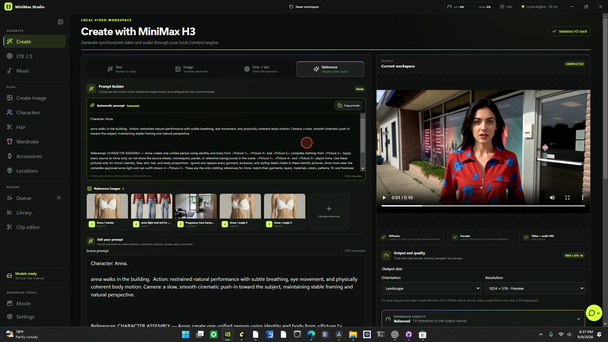
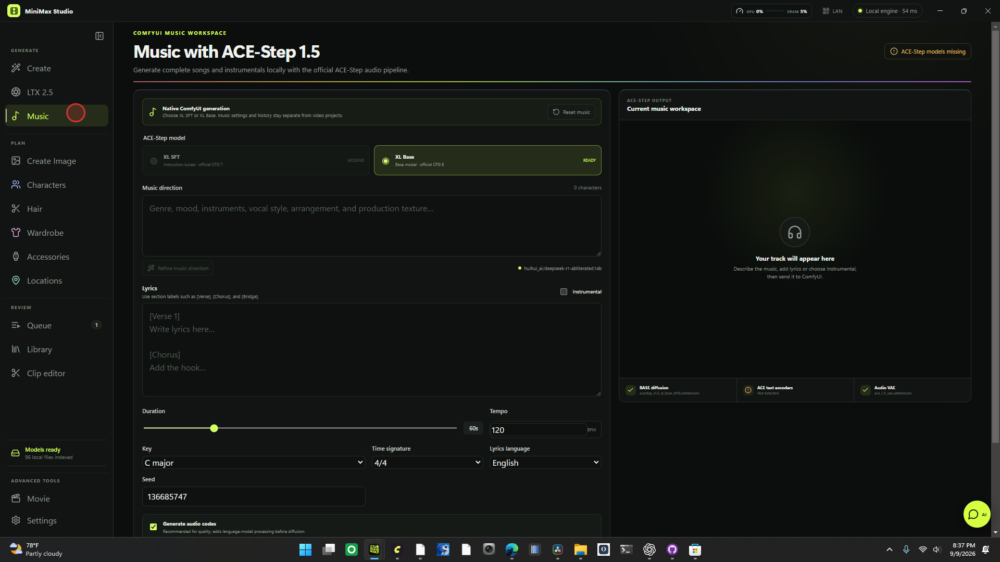
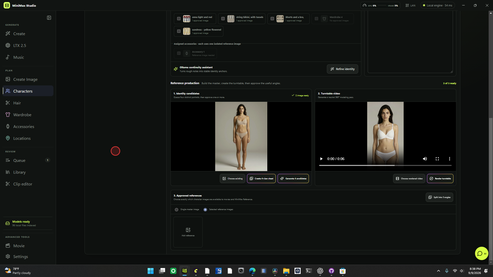
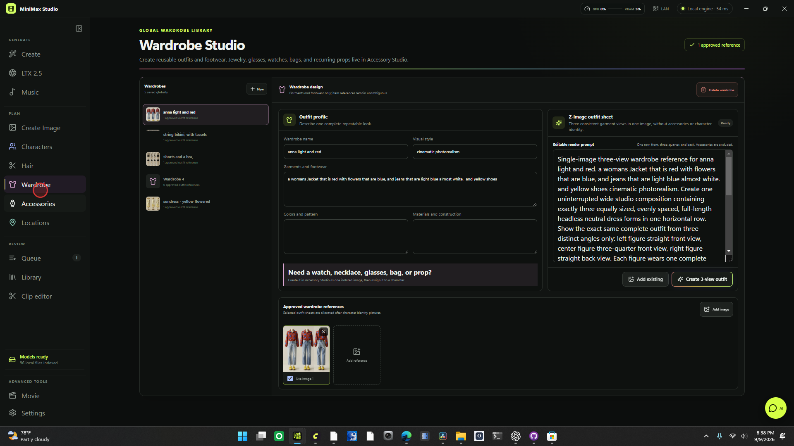
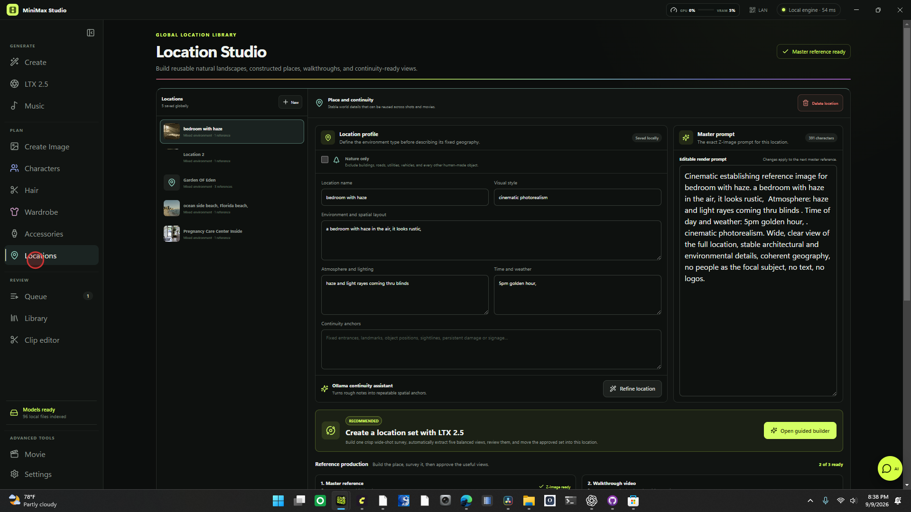
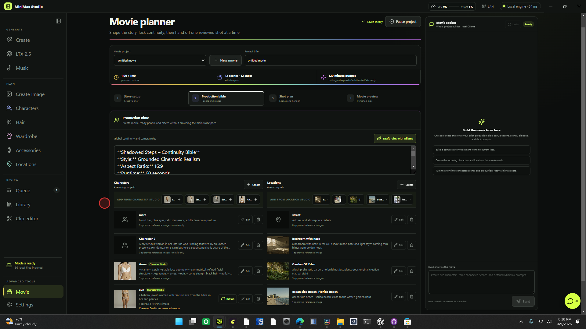

# MiniMax Studio

A local-first Windows desktop interface for MiniMax H3 generation through ComfyUI. Models are indexed and used from their existing locations; the application does not download, copy, or reorganize model files.

> **This is the Cobdog fork** of [jamesk9526/MINIMAX-DESKTOP](https://github.com/jamesk9526/MINIMAX-DESKTOP), under active restructure and hardening. The upstream project is days old and was built at AI-generation velocity; this fork's first moves were a [full inventory](docs/inventory.md), an [architecture review](docs/architecture.md), and adversarial [code-quality](docs/audit/code-quality-audit.md) and [security](docs/audit/security-audit.md) audits. Known issues are tracked there — read them before relying on the fragile paths (output attribution, job polling, library persistence).

## Capabilities

**Video generation (MiniMax H3)**
- Text-to-video, image-to-video (first frame), first+last-frame, and mixed reference generation (up to 9 images / 3 videos / 3 audio) through the FL2VA/Ref2VA models
- Official ComfyUI H3 graph topology and sampling defaults (`res_multistep` + `simple`), with detected FL2V 4/8-step and Ref2V 4-step turbo LoRAs
- Guided quality presets — Native Quality, official Turbo 8, Preview — with custom sampling isolated under an explicit Experimental disclosure
- A fixed-seed quality diagnostic that queues matching Native and Turbo 8 renders for direct A/B comparison
- Optional verified LTX 2.5 latent 2× post-processing (LTX-VAE encode → latent upsample → trim, audio retained) and explicitly experimental RTX/CUDA frame upscaling
- Non-destructive reference video clipping: preview a source, set in/out points, create a focused 2–15 s reference MP4

**Other providers (separate workspaces, separate state)**
- LTX-2.5 T2V/I2V with native synchronized audio, the official two-stage Quality preset and single-stage Turbo preset
- ACE-Step 1.5 music generation with XL SFT/Base checkpoint selection, lyric/instrumental modes, tempo/key/language controls, and FLAC output
- Z-Image Turbo first-frame and standalone still generation with direct I2V handoff

**Production libraries**
- Character Studio: Z-Image master references, I2V turntable generation, five-angle frame extraction, reference-set or single-image selection
- Hair, Wardrobe, Accessories, and Location studios with reusable references
- Movie Planner: Ollama-assisted scene/shot planning with a conversational copilot, field-level diff review, and undo history

**Local integration**
- Local Ollama prompt enhancement, timed shot planning, and synchronized-audio rewriting — prompt text never leaves the workstation
- In-app playback through a range-aware local media proxy (ComfyUI history or the configured output directory)
- Landscape/portrait/square output presets with automatic fitting and interactive crop preview
- Live WebSocket render progress and previews; GPU/VRAM telemetry; job queue with cancellation

**Mobile companion**
- Same-network phone/tablet access for MiniMax H3 or LTX-2.5 T2V/I2V creation with separate provider state, QR pairing, token rotation, video preview, and download

## Mobile companion

Launch MiniMax Studio, select **Mobile** in the top bar, and scan the QR code from a phone connected to the same trusted Wi-Fi or LAN. The private access token persists across desktop restarts, so saved phone links keep working. Use **Rotate access link** in the QR dialog to invalidate every previously scanned link. Windows Firewall may ask whether the app can accept private-network connections the first time.

The phone uses the model folders, ComfyUI address, and output settings configured on the desktop. Service is over local HTTP. Browsers require a trusted HTTPS origin for verified PWA installation and service-worker caching, so use the HTTP version in the browser or as a home-screen shortcut until the HTTPS pass is complete. **Caveat:** the "full Studio" desktop link opens the app with mock data in a browser — only the dedicated mobile interface can actually generate from a phone today (see [audit P1-4](docs/audit/code-quality-audit.md)).

## Local services

- ComfyUI defaults to `http://127.0.0.1:8188`
- Ollama defaults to `http://127.0.0.1:11434`; the app lists installed local text models and excludes embedding and cloud-backed entries

Both addresses, every model directory, and the ComfyUI output directory can be changed from Settings.

## Workflow compatibility

MiniMax generation is built from ComfyUI's official T2V/I2V/Ref2V core graph: native H3 conditioning, `RandomNoise`, `BasicGuider`, `res_multistep`, `simple`, joint video/audio latent decoding, and `CreateVideo`/`SaveVideo`. The app prefers the official pruned INT8 ConvRot diffusion safetensors, NVFP4-AWQ text encoder, FP16 video VAE, and FP32 audio VAE when multiple matching files exist. Live preview and LTX/RTX upscaling are separate output branches and do not alter the base H3 sampling path.

Turbo sampling uses the official sampler/scheduler pair unless custom sampling is explicitly enabled; custom combinations remain marked experimental because they are not equivalent to the published template.

Settings can persist resolution, duration, quality mode, full-quality steps, LoRA strength, reference-image fidelity, live preview, sampler/scheduler, and sigma-shift defaults. Native H3 behavior leaves shifts on the model baseline (video 12, audio 3); the Euler/Beta custom-shift preset is intentionally labeled experimental (targets converted Turbo LoRA compatibility, not the published template).

The **LTX 2.5** workspace is a separate provider and never reads or changes MiniMax prompts, inputs, turbo LoRAs, samplers, sigma shifts, or upscale choices. Its Quality preset follows ComfyUI's official two-stage distilled workflow (8-step half-res pass → LTX latent 2× → 3-step refinement); Turbo uses the official fixed 8-step distilled schedule as a single full-resolution stage.

## How generation works

The renderer sends media paths through a context-isolated Electron bridge. Electron uploads selected inputs to the configured local ComfyUI server and submits a native API-format graph using these core nodes:

- `MiniMaxH3ImageToVideo` or `MiniMaxH3ReferenceToVideo`
- `UNETLoader`, `CLIPLoader`, and separate video/audio `VAELoader` nodes
- `SamplerCustomAdvanced` with `res_multistep`
- `VAEDecode`, `VAEDecodeAudio`, `CreateVideo`, and `SaveVideo`

Durations are converted to MiniMax H3's required `17k + 5` frame grid at 24 fps. Reference autogrow inputs use ComfyUI's required dotted API keys, such as `ref_images.ref_image_0`.

For the full process model — IPC surface, WebSocket topology, persistence tiers, LAN server — see [docs/architecture.md](docs/architecture.md).

## ACE-Step 1.5 setup

The Music workspace submits the native ComfyUI ACE-Step 1.5 graph; it does not call a hosted music service. Install the following files into the configured ComfyUI model folders, then use **Settings → Test connection** and rescan models:

| ComfyUI folder | Required file |
| --- | --- |
| `models/diffusion_models` | `acestep_v1.5_xl_sft_bf16.safetensors` |
| `models/diffusion_models` | `acestep_v1.5_xl_base_bf16.safetensors` |
| `models/vae` | `ace_1.5_vae.safetensors` |
| `models/text_encoders` | `qwen_0.6b_ace15.safetensors` |
| `models/text_encoders` | `qwen_4b_ace15.safetensors` |

The app detects either XL checkpoint independently, so an installation with only Base or only SFT remains usable. A current ComfyUI build must expose `TextEncodeAceStepAudio1.5`, `EmptyAceStep1.5LatentAudio`, `ModelSamplingAuraFlow`, `VAEDecodeAudio`, and `SaveAudioAdvanced` in its object info. The generated graph follows Comfy-Org's published ACE-Step 1.5 templates: 50 Euler/simple diffusion steps, AuraFlow shift 3, and the published per-checkpoint CFG defaults (SFT 7, Base 6).

Reference downloads and node documentation are maintained by [Comfy-Org's ACE-Step 1.5 workflow templates](https://github.com/Comfy-Org/workflow_templates/tree/main/templates) and [the TextEncodeAceStepAudio1.5 embedded docs](https://github.com/Comfy-Org/embedded-docs/blob/main/comfyui_embedded_docs/docs/TextEncodeAceStepAudio1.5/en.md).

Generated tracks are written by ComfyUI's audio saver to the configured output directory as FLAC and appear in the Music workspace and Queue with an audio player.

## Requirements

- Windows (path handling in the main process assumes Windows separators)
- Node.js 20+, pnpm 10+
- A current local ComfyUI instance with MiniMax H3 core nodes (and LTX-2.5 or ACE-Step 1.5 core nodes when using those workspaces)
- The MiniMax H3 model components already present on disk
- Optional: local Ollama for prompt features; NVIDIA GPU tooling for telemetry

The default model root is `%USERPROFILE%\Documents\ComfyUI\models`, but every category can be changed in **Settings → Model locations**.

## Development

```powershell
pnpm install
pnpm build
pnpm dev
```

The launcher removes `ELECTRON_RUN_AS_NODE` from Electron's child environment, so `pnpm start` and `pnpm dev` work even when an automation or parent shell sets it.

Start ComfyUI separately, then use **Settings → Test connection**. The default server is `http://127.0.0.1:8188`.

### Build and package

```powershell
pnpm build
pnpm package:win
```

The one-click per-user NSIS installer (desktop and Start-menu shortcuts) is written to `release\MiniMax-Studio-Setup-0.1.0.exe`.

### Tests

There is no test framework wired yet. `scripts/test-workflows.cjs` holds a genuine assertion suite (graph shape, node-link resolution, frame-grid math) — run it manually with `node scripts/test-workflows.cjs` until it's wired into `pnpm test` (tracked in the fork's hardening plan).

## Documentation

| Doc | Contents |
| --- | --- |
| [docs/architecture.md](docs/architecture.md) | Process model, IPC surface, generation pipeline, persistence tiers |
| [docs/inventory.md](docs/inventory.md) | Exhaustive file/feature/dependency census |
| [docs/audit/code-quality-audit.md](docs/audit/code-quality-audit.md) | Adversarial review: P0–P3 findings, top-10 fixes |
| [docs/audit/security-audit.md](docs/audit/security-audit.md) | Threat model, HIGH→INFO findings, hardening priorities |
| [docs/history/plan-v0.md](docs/history/plan-v0.md) | Upstream's original planning document (historical) |

## Screenshots

Captured from the desktop workflow.

### Reference prompt builder

The reference mode keeps the generated reference instructions visible above the editable prompt, numbers each image, and preserves the existing video output preview.



### ACE-Step 1.5 music generation

Music is a first-class sidebar workspace exposing the two XL checkpoints, lyric or instrumental generation, and audio-specific controls.



### Reusable production libraries

Character, wardrobe, and location studios keep reusable references and continuity details in separate libraries that can be brought into movie planning.









## License

None yet. Upstream carries no license, which means all-rights-reserved by default; treat this fork as private-use until licensing is clarified with upstream.
